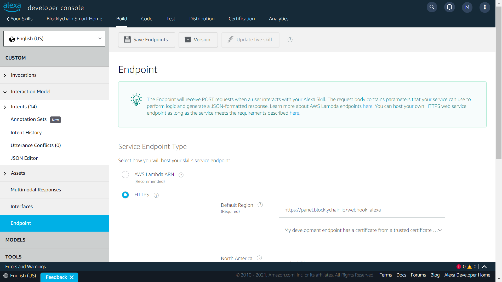
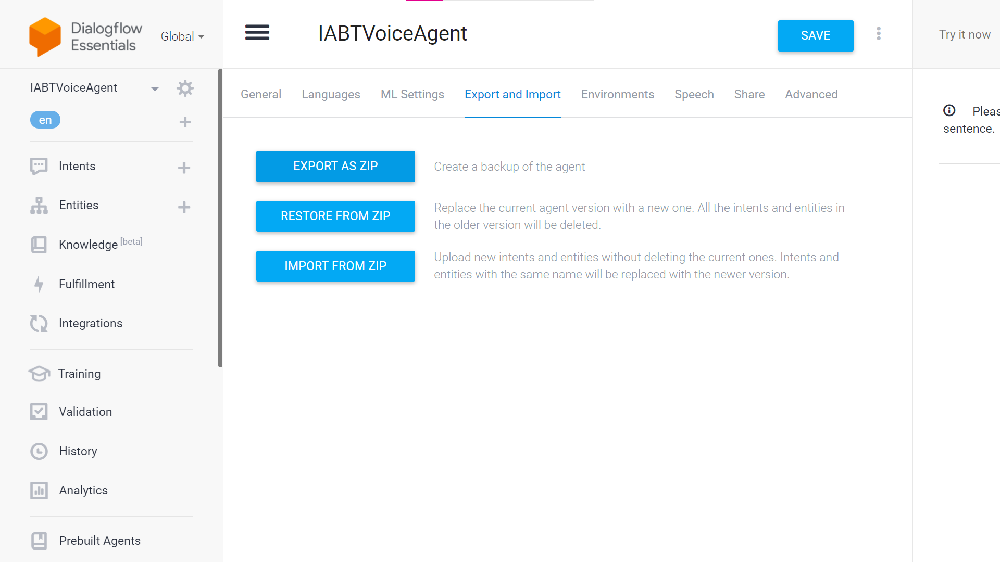

[]()

# How to enable voice commands in bkc-node

In order to enable voice commands via Alexa or Google Assistant for a node, follow the next instructure:

### 1. Setting up your Webhook
1. Download or clone the "voice-assistant" repo.
2. Run the code on the server using NodeJs or PM2.
```sh
$ cd voice-assistant
$ sudo npm install
$ node src/index.js
## Alternative
$ pm2 start src/index.js
```
3. Update your Nginx web server config file to redirect https traffic from `https://your.node.server/webhook_alexa` and `https://your.node.server/webhook`
   to port 9122 like bellow
   ```
   ## This config is set in "6- Install nginx web server" readme bkc-node-source-development
   ```
   

### 2. Alexa Setting
1. Create an <a href="https://developer.amazon.com/alexa/console/ask">Amazon developer account</a>.
2. Download the schema definition file named <a href="assets/BKC-Alexa-schema.json">BKC-Alexa-Schema.json</a> from the BKC git repository.
3. Create a skill (custom).
4. Navigate to the "Json Editor" page in the Alexa console and upload the json file.
5. Click on the "Save Model" button.
6. Click on the "Build Model" button.
7. Go to the Endpoint menu.
8. Select "HTTPS".
9. In the "Default Region" box, set your webhook URL `i.e. https://your.node.server/webhook_alexa`
10. In the certificate box, select the "My development endpoint has a certificate from a trusted certificate authority" item.
11. Click the "Save Endpoints" button.
    

### 3. Google Assistant Setting
1. Create a <a href="https://dialogflow.cloud.google.com/">Google developer account</a>.
2. Go to the <a href="https://dialogflow.cloud.google.com/">Dialogflow panel</a>.
3. Create a new "Agent".
4. Download the <a href="assets/BKCVoiceAgent.zip">BKCVoiceAgent.zip</a> file from the BKC Node GitHub.
5. In Dialogflow, go to "Settings" and the "Export and Import" tab.
6. Upload the zip file on your developer account using the "RESTORE FROM ZIP" button.
   
7. Go to the "Fullfillment" menu and set your webhook URL to `https://your.node.server/webhook_google`
   
8. Click the "SAVE" button on the bottom of the page.
